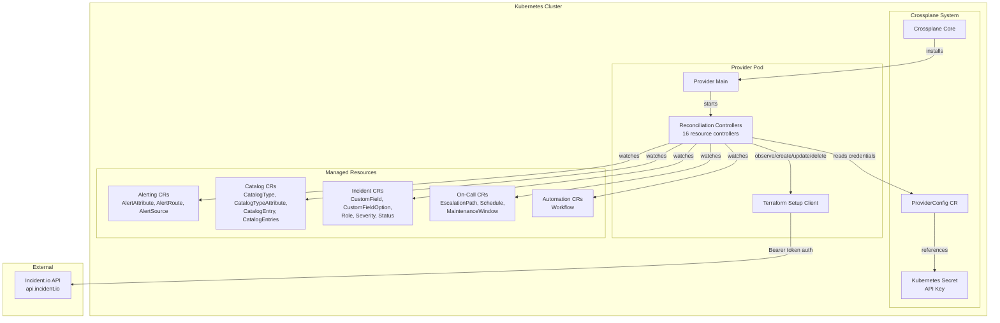
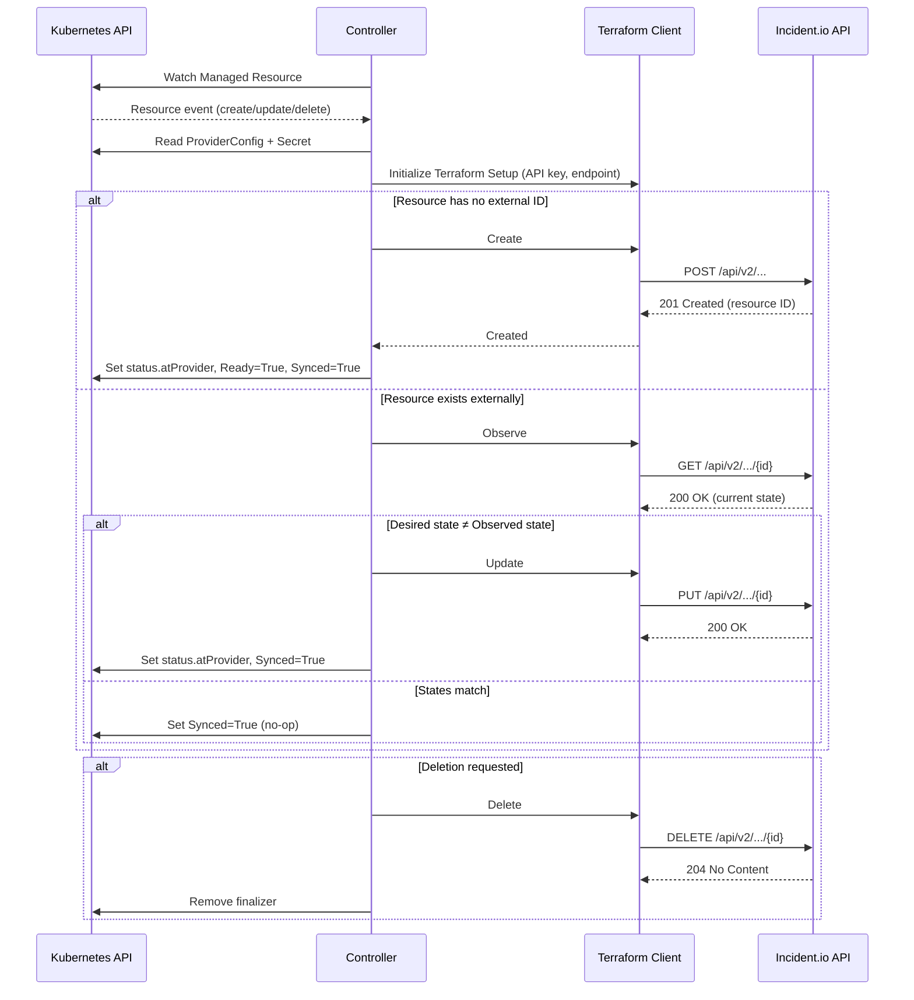
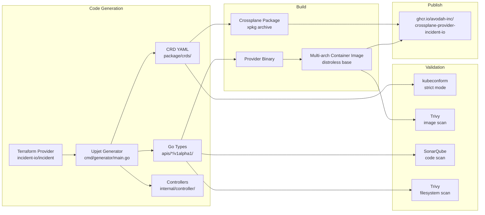
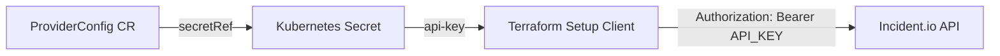

# Design Document

## Overview

This document describes the design for a Crossplane Provider that enables Kubernetes-native management of Incident.io resources. The provider is generated using [Upjet](https://github.com/crossplane/upjet) from the official [Terraform provider](https://registry.terraform.io/providers/incident-io/incident/latest/docs) (`incident-io/incident`), producing CRDs and controllers for 16 Incident.io resources across 5 domain groups.

The provider follows the standard Upjet code generation pattern: Terraform resource schemas are consumed by the Upjet pipeline to produce Go type definitions, CRDs, and reconciliation controllers. Platform engineers declare Incident.io resources as Kubernetes Custom Resources, and the provider's controllers reconcile them against the Incident.io API using Bearer token authentication.

### Key Design Decisions

1. **Upjet over hand-written controllers**: Upjet generates controllers directly from Terraform provider schemas, ensuring API parity with the upstream Terraform provider and reducing maintenance burden. The trade-off is less control over individual resource behavior, but the Incident.io API surface is well-suited to Upjet's generation model.

2. **Single API group with domain subgroups**: All resources live under `incidentio.crossplane.io/v1alpha1`, organized into domain-specific Go packages (`alerting`, `catalog`, `incident`, `oncall`, `automation`). This keeps the API surface discoverable while maintaining code organization.

3. **v1alpha1 version**: The initial release uses `v1alpha1` to signal that the API may change as the upstream Terraform provider evolves. Promotion to `v1beta1` or `v1` will follow once the resource schemas stabilize.

4. **Distroless multi-arch image**: The provider binary runs in a distroless container to minimize attack surface, supporting both `amd64` and `arm64` for broad cluster compatibility.

## Architecture

### High-Level Architecture



### Reconciliation Lifecycle

Each managed resource controller follows the standard Crossplane reconciliation loop, powered by Upjet's Terraform-based external client:



### Build and Distribution Pipeline



## Components and Interfaces

### 1. Provider Entrypoint (`cmd/provider/main.go`)

The provider binary entrypoint initializes the Crossplane runtime, registers all controllers, and starts the controller manager.

```go
// Responsibilities:
// - Parse CLI flags (debug, poll interval, max reconcile rate)
// - Initialize controller-runtime manager
// - Register all 16 resource controllers via Setup functions
// - Start the manager's reconciliation loop
```

### 2. Generator Entrypoint (`cmd/generator/main.go`)

The Upjet code generator entrypoint consumes the Terraform provider schema and produces Go types, CRDs, and controllers.

```go
// Responsibilities:
// - Load Terraform provider binary
// - Read provider configuration from config/provider.go
// - Generate Go types under apis/
// - Generate CRD YAML under package/crds/
// - Generate controllers under internal/controller/
```

### 3. Provider Configuration (`config/provider.go`)

Central Upjet configuration that defines the provider metadata and resource inclusion list.

```go
// Key configuration:
// - Provider name: "incident-io"
// - Root API group: "incidentio.crossplane.io"
// - Resource list: all 16 Terraform resources
// - Default resource configuration (e.g., late initialization behavior)
```

### 4. External Name Configuration (`config/external_name.go`)

Maps each Terraform resource to its external naming strategy, which determines how Crossplane identifies the external resource.

| Terraform Resource | External Name Strategy | Rationale |
|---|---|---|
| `incident_alert_attribute` | `IdentifierFromProvider` | ID assigned by Incident.io API |
| `incident_alert_route` | `IdentifierFromProvider` | ID assigned by Incident.io API |
| `incident_alert_source` | `IdentifierFromProvider` | ID assigned by Incident.io API |
| `incident_catalog_type` | `IdentifierFromProvider` | ID assigned by Incident.io API |
| `incident_catalog_type_attribute` | `IdentifierFromProvider` | ID assigned by Incident.io API |
| `incident_catalog_entry` | `IdentifierFromProvider` | ID assigned by Incident.io API |
| `incident_catalog_entries` | `IdentifierFromProvider` | ID assigned by Incident.io API |
| `incident_custom_field` | `IdentifierFromProvider` | ID assigned by Incident.io API |
| `incident_custom_field_option` | `IdentifierFromProvider` | ID assigned by Incident.io API |
| `incident_role` | `IdentifierFromProvider` | ID assigned by Incident.io API |
| `incident_severity` | `IdentifierFromProvider` | ID assigned by Incident.io API |
| `incident_status` | `IdentifierFromProvider` | ID assigned by Incident.io API |
| `incident_escalation_path` | `IdentifierFromProvider` | ID assigned by Incident.io API |
| `incident_schedule` | `IdentifierFromProvider` | ID assigned by Incident.io API |
| `incident_maintenance_window` | `IdentifierFromProvider` | ID assigned by Incident.io API |
| `incident_workflow` | `IdentifierFromProvider` | ID assigned by Incident.io API |

All Incident.io resources use server-assigned UUIDs, so `IdentifierFromProvider` is the appropriate strategy across the board.

### 5. Per-Resource Configuration (`config/<domain>/config.go`)

Each domain group has a configuration file that registers resources with the Upjet pipeline and applies any per-resource overrides.

```go
// config/alerting/config.go
// - Registers: incident_alert_attribute, incident_alert_route, incident_alert_source
// - Sets API group: "alerting"
// - Applies resource-specific overrides (references, sensitive fields, etc.)

// config/catalog/config.go
// - Registers: incident_catalog_type, incident_catalog_type_attribute,
//              incident_catalog_entry, incident_catalog_entries
// - Sets API group: "catalog"

// config/incident/config.go
// - Registers: incident_custom_field, incident_custom_field_option,
//              incident_role, incident_severity, incident_status
// - Sets API group: "incident"

// config/oncall/config.go
// - Registers: incident_escalation_path, incident_schedule, incident_maintenance_window
// - Sets API group: "oncall"

// config/automation/config.go
// - Registers: incident_workflow
// - Sets API group: "automation"
```

### 6. Terraform Setup Client (`internal/clients/incident.go`)

Configures the Terraform provider runtime with credentials read from the ProviderConfig's referenced Secret.

```go
// Responsibilities:
// - Read ProviderConfig CR
// - Extract secretRef and read the Kubernetes Secret
// - Build Terraform provider configuration map:
//   - api_key: from Secret data
//   - endpoint: optional, defaults to https://api.incident.io
// - Return terraform.Setup for use by Upjet controllers
```

### 7. ProviderConfig Type (`apis/v1alpha1/providerconfig.go`)

The ProviderConfig CRD type that holds authentication configuration.

```yaml
apiVersion: incidentio.crossplane.io/v1alpha1
kind: ProviderConfig
metadata:
  name: default
spec:
  credentials:
    source: Secret
    secretRef:
      namespace: crossplane-system
      name: incident-io-credentials
      key: api-key
```

### 8. Package Metadata (`package/crossplane.yaml`)

Declares the Crossplane provider package for distribution.

```yaml
apiVersion: meta.pkg.crossplane.io/v1
kind: Provider
metadata:
  name: provider-incident-io
spec:
  crossplane:
    version: ">=v1.14.0"
  controller:
    image: ghcr.io/avodah-inc/crossplane-provider-incident-io:VERSION
```

## Data Models

### Managed Resource Structure

All 16 managed resources follow the standard Crossplane managed resource structure. The `spec.forProvider` fields are generated directly from the Terraform resource schema.

```yaml
apiVersion: incidentio.crossplane.io/v1alpha1
kind: <ResourceKind>
metadata:
  name: <resource-name>
  annotations:
    crossplane.io/external-name: <incident-io-uuid>  # Set by provider after creation
spec:
  forProvider:
    # Fields generated from Terraform resource schema
    # Varies per resource type
  providerConfigRef:
    name: default  # References ProviderConfig for auth
  managementPolicies:
    - "*"  # Default: full lifecycle management
status:
  atProvider:
    # Observed state from Incident.io API
    # Mirrors forProvider fields + read-only fields (id, timestamps, etc.)
  conditions:
    - type: Ready
      status: "True" | "False"
      reason: Available | Creating | Deleting | ...
    - type: Synced
      status: "True" | "False"
      reason: ReconcileSuccess | ReconcileError
      message: <error details if failed>
```

### Domain Group Resource Schemas

#### Alerting Domain

**AlertAttribute** (`incident_alert_attribute`)

- `spec.forProvider.name` (string, required): Attribute name
- `spec.forProvider.type` (string, required): Attribute type (e.g., `text`, `single_select`)
- `spec.forProvider.array` (bool, optional): Whether the attribute accepts multiple values

**AlertRoute** (`incident_alert_route`)

- `spec.forProvider.alertSourceId` (string, required): ID of the alert source
- `spec.forProvider.conditions` (list, optional): Routing conditions
- `spec.forProvider.escalationBindings` (list, optional): Escalation targets
- `spec.forProvider.groupingKeys` (list, optional): Keys for alert grouping

**AlertSource** (`incident_alert_source`)

- `spec.forProvider.name` (string, required): Source name
- `spec.forProvider.type` (string, required): Source type

#### Catalog Domain

**CatalogType** (`incident_catalog_type`)

- `spec.forProvider.name` (string, required): Type name
- `spec.forProvider.description` (string, required): Type description
- `spec.forProvider.semanticType` (string, optional): Semantic type hint

**CatalogTypeAttribute** (`incident_catalog_type_attribute`)

- `spec.forProvider.name` (string, required): Attribute name
- `spec.forProvider.type` (string, required): Attribute type
- `spec.forProvider.catalogTypeId` (string, required): Parent catalog type ID
- `spec.forProvider.array` (bool, optional): Whether the attribute accepts multiple values

**CatalogEntry** (`incident_catalog_entry`)

- `spec.forProvider.catalogTypeId` (string, required): Parent catalog type ID
- `spec.forProvider.name` (string, required): Entry name
- `spec.forProvider.attributeValues` (map, optional): Attribute key-value pairs

**CatalogEntries** (`incident_catalog_entries`)

- `spec.forProvider.catalogTypeId` (string, required): Parent catalog type ID
- `spec.forProvider.entries` (list, required): Bulk entry definitions

#### Incident Configuration Domain

**CustomField** (`incident_custom_field`)

- `spec.forProvider.name` (string, required): Field name
- `spec.forProvider.description` (string, required): Field description
- `spec.forProvider.fieldType` (string, required): Field type (`text`, `single_select`, `multi_select`, `link`, `numeric`)

**CustomFieldOption** (`incident_custom_field_option`)

- `spec.forProvider.customFieldId` (string, required): Parent custom field ID
- `spec.forProvider.value` (string, required): Option value
- `spec.forProvider.sortKey` (int, optional): Sort order

**Role** (`incident_role`)

- `spec.forProvider.name` (string, required): Role name
- `spec.forProvider.description` (string, required): Role description
- `spec.forProvider.instructions` (string, optional): Role instructions
- `spec.forProvider.required` (bool, optional): Whether the role is required

**Severity** (`incident_severity`)

- `spec.forProvider.name` (string, required): Severity name
- `spec.forProvider.description` (string, required): Severity description
- `spec.forProvider.rank` (int, required): Severity rank (lower = more severe)

**Status** (`incident_status`)

- `spec.forProvider.name` (string, required): Status name
- `spec.forProvider.description` (string, required): Status description
- `spec.forProvider.category` (string, required): Status category (`triage`, `active`, `post-incident`, `closed`)

#### On-Call Domain

**EscalationPath** (`incident_escalation_path`)

- `spec.forProvider.name` (string, required): Path name
- `spec.forProvider.path` (list, required): Ordered escalation levels with targets and timeouts

**Schedule** (`incident_schedule`)

- `spec.forProvider.name` (string, required): Schedule name
- `spec.forProvider.timezone` (string, required): Schedule timezone
- `spec.forProvider.rotations` (list, required): Rotation definitions

**MaintenanceWindow** (`incident_maintenance_window`)

- `spec.forProvider.name` (string, required): Window name
- `spec.forProvider.startsAt` (string, required): Window start time (RFC 3339)
- `spec.forProvider.endsAt` (string, required): Window end time (RFC 3339)
- `spec.forProvider.resources` (list, required): Resources affected by the window

#### Automation Domain

**Workflow** (`incident_workflow`)

- `spec.forProvider.name` (string, required): Workflow name
- `spec.forProvider.trigger` (object, required): Workflow trigger configuration
- `spec.forProvider.steps` (list, required): Ordered workflow steps
- `spec.forProvider.conditionGroups` (list, optional): Conditions for workflow execution

### Authentication Data Flow



The API key is org-level and remains valid even if the creating user is deactivated. Rate limit is 1200 requests/minute per API key.

## Error Handling

### API Error Handling

| Error Scenario | HTTP Status | Provider Behavior |
|---|---|---|
| Invalid API key | 401 | Set `Synced=False`, reason: `ReconcileError`, message: authentication failure |
| Insufficient permissions | 403 | Set `Synced=False`, reason: `ReconcileError`, message: authorization failure |
| Resource not found (observe) | 404 | Trigger create operation to restore the resource |
| Validation error | 422 | Set `Synced=False`, reason: `ReconcileError`, message: validation details |
| Rate limit exceeded | 429 | Upjet/Terraform client retries with backoff; transient `Synced=False` |
| Server error | 5xx | Set `Synced=False`, reason: `ReconcileError`; retry on next reconciliation |

### Credential Error Handling

| Error Scenario | Provider Behavior |
|---|---|
| Secret not found | ProviderConfig `Ready=False`, reason: missing secret |
| Secret key missing | ProviderConfig `Ready=False`, reason: missing key in secret |
| Invalid API key format | ProviderConfig `Ready=False`, reason: authentication failure |

### Reconciliation Error Recovery

- **Transient errors** (429, 5xx): The controller retries on the next reconciliation interval. Upjet uses exponential backoff for repeated failures.
- **Permanent errors** (401, 403, 422): The controller sets `Synced=False` and continues retrying, allowing the user to fix the configuration. The error message is surfaced in the status condition.
- **Drift detection**: On each reconciliation, the controller observes the external resource state. If the external state differs from the desired state (drift), the controller issues an update to restore convergence.
- **External deletion**: If the external resource is deleted outside of Crossplane, the observe operation returns "not found" and the controller re-creates the resource.

### Build Pipeline Error Handling

| Validation Step | Failure Behavior |
|---|---|
| kubeconform CRD validation | Pipeline fails with specific CRD validation errors |
| Trivy filesystem scan | Pipeline fails if critical/high/medium vulnerabilities found |
| Trivy image scan | Pipeline fails if critical/high/medium vulnerabilities found |
| SonarQube scan | Pipeline reports code quality metrics |

## Testing Strategy

### Why Property-Based Testing Does Not Apply

This provider is an Infrastructure as Code (IaC) project. The core deliverables are:

- **Upjet code generation**: Declarative configuration mapping Terraform schemas to Crossplane CRDs. The generation pipeline is deterministic — the same input schema always produces the same output. There are no pure functions with variable input spaces to test with PBT.
- **CRD definitions**: Static YAML schemas validated by kubeconform. These are declarative artifacts, not functions.
- **Controller reconciliation**: Generated by Upjet from Terraform provider logic. The reconciliation behavior is inherited from the upstream Terraform provider and the Upjet runtime, both of which are tested by their respective projects.
- **Container image and packaging**: Build pipeline artifacts validated by security scanners and schema validators.

Per the design guidelines: "IaC is declarative configuration, not a function with inputs/outputs. Use snapshot tests and policy/compliance checks instead."

### Testing Approach

#### 1. CRD Schema Validation (Validates Requirements 1, 11)

Validate all generated CRDs against Kubernetes schemas using kubeconform in strict mode.

```bash
kubeconform \
  -schema-location default \
  -schema-location "https://raw.githubusercontent.com/datreeio/CRDs-catalog/main/{{.Group}}/{{.ResourceKind}}_{{.ResourceAPIVersion}}.json" \
  -strict \
  -summary package/crds/
```

- Validates structural correctness of all 16 CRDs
- Runs in strict mode to catch extra/missing fields
- Integrated into CI pipeline as a gate

#### 2. Code Generation Smoke Tests (Validates Requirements 1, 3–7, 13)

Verify that `make generate` produces the expected output:

- All 16 Go type files exist under `apis/` in the correct domain subdirectories
- All 16 CRD YAML files exist under `package/crds/`
- All 16 controller files exist under `internal/controller/`
- All CRDs use API group `incidentio.crossplane.io` and version `v1alpha1`
- Go types compile without errors (`make build`)

#### 3. Security Scanning (Validates Requirement 12)

- **Trivy filesystem scan**: Scan source code and dependencies for known vulnerabilities
- **Trivy image scan**: Scan the built container image for vulnerabilities
- **SonarQube scan**: Analyze code quality and security hotspots
- All scans must pass with no critical, high, or medium severity findings

#### 4. Integration Tests (Validates Requirements 2, 3–8)

End-to-end tests against a real Incident.io API (or sandbox environment):

- **ProviderConfig lifecycle**: Create ProviderConfig with valid/invalid secrets, verify status conditions
- **Managed resource CRUD**: For each resource type, create → observe → update → delete and verify:
  - External resource exists in Incident.io after create
  - `status.atProvider` reflects current external state
  - `Ready=True` and `Synced=True` after successful reconciliation
  - External resource is updated when spec changes
  - External resource is deleted when CR is deleted
- **Error scenarios**: Invalid credentials, missing secrets, API validation errors

#### 5. Package Validation (Validates Requirements 10, 14)

- Verify `make xpkg-build` produces a valid xpkg archive
- Verify the xpkg contains `crossplane.yaml` and all CRD files
- Verify the package installs successfully in a test cluster
- Verify all 16 CRDs are registered after installation

#### 6. Container Image Validation (Validates Requirement 9)

- Verify multi-arch manifest includes `linux/amd64` and `linux/arm64`
- Verify the image uses a distroless base (no shell, no package manager)
- Verify the provider binary starts and responds to health checks
